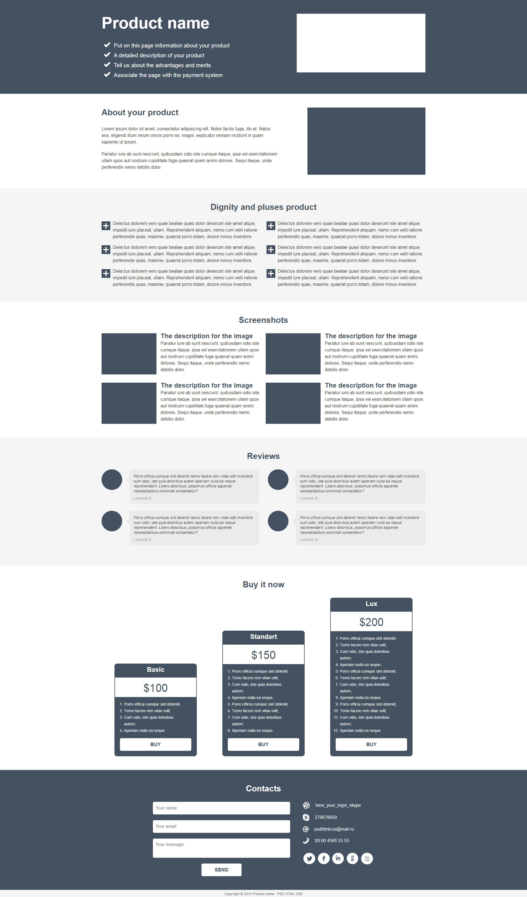

# Проект для вёрстки

### **_Учебный проект из курса [Компетенция Верстальщик - HTML, CSS, JavaScript](https://www.udemy.com/course/web-coder/)_**

**Автор курса: [Михаил Непомнящий](https://www.udemy.com/user/mikhail-nepomniashchii/)**

## Описание проекта

Проект является шаблоном для разработки и вертски веб-страниц и UI Kit к ним.

## Функционал:

- User eXperience (UX);
- Адаптивный интерфейс для разных устройств.

## Стек технологий:

- HTML5;
- CSS3:
  - Flexbox;
  - Positioning;
  - Adaptive UI;
  - Media Queries;
- Вендорные префиксы в CSS;
- Препроцессор SCSS;
- Иконочные шрифты;
- Cборщик проекта ParcelJS.

## Установка и запуск приложения:

Клонировать репозиторий:

    git clone https://github.com/ia-stepanov/wwwtemplate.git

Установить зависимости:

    npm install

Запустить приложение:

    npm run dev

## Макет в PSD:

- [Макет wwwtemplate](https://att-c.udemycdn.com/2020-06-04_20-55-42-b2fddf6334f43d1865b1cd3934111e4f/original.psd?response-content-disposition=attachment%3B+filename%3Dsimple_psd_template.psd&Expires=1722827373&Signature=M8PZ7tegGUH4BaEju-5ggi7X5BBPc6yQRQkLE8ibxwKR1xKXpNq51zX14~wVBzUefmh4Q44dv~PBFm6R-maYoogOgK1OaVRbfxpHcDxFWf1eEzNlNN8isWrlDCnY1J1DKVD7~pTEGaQeDGA1jqyLTyrOI9GLDoLfp~PQOMzQ89cvH1paE0VQiyanuefQKD0EPq5pAQ~S3pPb~MSqYFsdZY11r86AdrmPoB6AhsKUBmsms4820LCDiR6v5c9CjbSx9UWqHnPGhey~JZkHdEhhsA3SU7grLNn6YVcqzvCGRxxJG2ivWgNUUDQ6zYBs1XWc4KYdtx-xQPJAC1bDihNEQg__&Key-Pair-Id=K3MG148K9RIRF4)

## Скриншот:

<b>Развернуть</b>

## Ссылка на сайт:

https://ia-stepanov.github.io/wwwtemplate/
